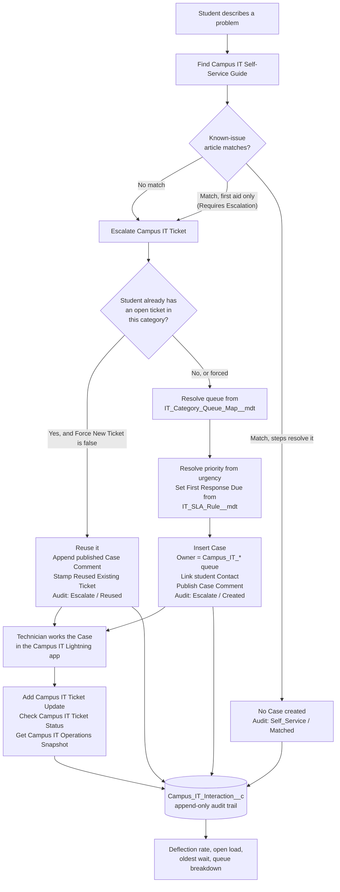

# Campus IT Service Desk Triage

[](https://developer.salesforce.com/tools/salesforcecli)
[](sfdx-project.json)
[](LICENSE)

A native **Service Cloud** triage backend for a university IT service desk. It tries a
known-issue guide first, opens exactly one Case on the right queue when a human is genuinely
needed, reuses that ticket instead of creating a duplicate, starts a first-response clock, and
writes an append-only audit row so the desk can prove what it deflected.

Five Apex invocable actions, routing and SLA rules in Custom Metadata, five `Campus_IT_*` queues,
an append-only audit object, and a Lightning app technicians already know how to use. No external
service, no Connected App, no runtime secrets.

**One command from a fresh clone to a working org with sample data:**

```bash
./scripts/setup-scratch-org.sh
```

Design decisions and their tradeoffs: [`ARCHITECTURE.md`](ARCHITECTURE.md)

---

## The problem

Campus service desks get the same requests every shift: WiFi, password resets, MFA, VPN, a
course missing from the LMS, a print job that will not release, a new student with no account
yet. Two things go wrong.

**Work that a documented procedure could finish sits in the same queue as work that needs a
technician.** A cracked laptop before an exam waits behind twenty password resets.

**Nobody can prove what the desk deflected.** Front-ends that only search a FAQ make this worse:
they open duplicate tickets, they route by guesswork, and they leave no record you can count.

This backend addresses both. Routing is deterministic and configured by the people who own the
vocabulary. Deflection is a number you can query, because every action leaves a row.

---

## Triage flow



Every path ends at the audit object. That is the point: the deflected conversations and the
escalated ones are counted in the same place, so `matches ÷ (matches + new Cases)` is a number
the desk can actually stand behind.

---

## Architecture overview

| Layer | What it is |
| --- | --- |
| Actions | Five `public with sharing` Apex classes, one `@InvocableMethod` each, `List` in and `List` out |
| Routing | `ITDeskRoutingService` + `IT_Category_Queue_Map__mdt` → `Campus_IT_*` queues |
| Catalog | `IT_Known_Issue__mdt` — keywords, resolution steps, requires-escalation, active flag |
| SLA | `IT_SLA_Rule__mdt` — High 4h, Medium 16h, Low 40h → `Case.First_Response_Due__c` |
| Audit | `Campus_IT_Interaction__c` + `ITDeskAuditService` + a before-update/delete trigger |
| Workspace | Lightning app `Campus_IT`, Case layout, list views, permission set |
| Delivery | Salesforce DX source, API 64.0 |

The five actions:

| Action label | Class | Writes |
| --- | --- | --- |
| Find Campus IT Self-Service Guide | `ITDeskSelfService` | Interaction only |
| Escalate Campus IT Ticket | `ITDeskTicketEscalation` | Case, Case Comment, Interaction |
| Add Campus IT Ticket Update | `ITDeskTicketUpdate` | Case Comment, Interaction |
| Check Campus IT Ticket Status | `ITDeskTicketStatus` | Interaction |
| Get Campus IT Operations Snapshot | `ITDeskOperationsSnapshot` | Interaction |

They are invocable actions rather than a bespoke API so the same code is callable from Flow,
from Process Builder, from the REST actions endpoint, and from anonymous Apex without a wrapper
for each. Every action returns a result per request instead of throwing, so one bad record in a
batch of 200 fails that record and no other.

No Salesforce record Ids are hardcoded anywhere. Queues are referenced by `DeveloperName`.

---

## How routing works

A category string comes in. The routing service normalizes it, matches it against the keywords
and aliases on `IT_Category_Queue_Map__mdt`, and returns a queue `DeveloperName`. If nothing
matches, the row flagged **Is Default** wins.

| Keyword | Aliases | Queue |
| --- | --- | --- |
| `network` | wifi, vpn, wireless, eduroam | `Campus_IT_Network` |
| `hardware` | laptop, printer, printing, peripheral, projector | `Campus_IT_Hardware` |
| `software` | application, license, email, outlook, lms, canvas, blackboard, moodle | `Campus_IT_Software` |
| `account` | password, login, identity, mfa, provisioning, onboarding | `Campus_IT_Identity` |
| *(default)* | | `Campus_IT_General` |

Adding "eduroam" to the network row is a Custom Metadata edit in Setup. No deploy, no code
review, no release window. That is the whole reason routing is not in Apex —
[the reasoning is in `ARCHITECTURE.md`](ARCHITECTURE.md#routing-rules-live-in-custom-metadata-not-in-apex-and-not-in-a-flow),
including what it costs.

The queue then determines the canonical `Case.IT_Category__c` label the technician sees:
Network, Hardware, Software, Account, or General.

Urgency maps to Case Priority by token: `critical`, `emergency`, `urgent`, `high`, `p1`, `p2`,
`sev1` → **High**; `low`, `p4`, `sev4` → **Low**; everything else, including a blank, → **Medium**.
Priority then selects the first-response target from `IT_SLA_Rule__mdt`.

> **Known limitation.** When a category matches two rules, which one wins is not specified,
> because Apex defines no iteration order for `Map`. See issue A in
> [`ARCHITECTURE.md`](ARCHITECTURE.md#known-issues) for the proposed fix.

---

## Deploy to a scratch org

**Prerequisites:** the [Salesforce CLI](https://developer.salesforce.com/tools/salesforcecli)
and an authenticated Dev Hub.

```bash
git clone https://github.com/AndrewLengLy/Campus-IT-Triage-Agent.git
cd Campus-IT-Triage-Agent

sf org login web --set-default-dev-hub     # once, if you have not already

./scripts/setup-scratch-org.sh
```

The script creates the scratch org, deploys `force-app`, assigns the permission set, seeds the
sample data, runs the Apex tests with coverage, and opens the org.

```
-a, --alias <name>   scratch org alias            (default: campus-it-dev)
-d, --days <n>       duration in days             (default: 7)
    --no-open        do not open a browser
    --no-tests       skip the test run
    --keep           reuse an existing org with this alias
```

### Deploying to a Developer Edition org or Trailhead Playground instead

Those orgs are not source-tracked, so deploy rather than push:

```bash
sf org login web --alias campus-it-dev --set-default
sf project deploy start --source-dir force-app --target-org campus-it-dev --wait 20
sf org assign permset --name Campus_IT_Triage_Agent --target-org campus-it-dev
sf apex run --file scripts/apex/seedSampleData.apex --target-org campus-it-dev
```

The manifest deploys the same metadata:
`sf project deploy start --manifest manifest/package.xml --target-org campus-it-dev`

### Sample data

`scripts/apex/seedSampleData.apex` is idempotent. It creates eight students and drives real
traffic through the actions, so the org comes up with routed tickets, live SLA clocks, published
Case Comments, and an audit trail with a believable deflection rate, rather than records that
merely look right.

| Student | Name | Scenario | Lands on |
| --- | --- | --- | --- |
| S10000001 | Alex Rivera | WiFi drops — guide resolves it | *deflected, no ticket* |
| S10000002 | Jordan Chen | Laptop will not power on, exam tomorrow | `Campus_IT_Hardware`, High |
| S10000003 | Sam Patel | File share help, uncategorized | `Campus_IT_General`, Low |
| S10000004 | Priya Nair | Password reset, then Outlook offline | *deflected*, then `Campus_IT_Software` |
| S10000005 | Marcus Bell | Course missing from the LMS | `Campus_IT_Software`, Medium |
| S10000006 | Wei Zhang | Print job will not release, plus a follow-up comment | `Campus_IT_Hardware`, Low |
| S10000007 | Nadia Haddad | New account not provisioned | `Campus_IT_Identity`, High |
| S10000008 | Tom Okafor | VPN will not connect off campus | `Campus_IT_Network`, Medium |

---

## Run the tests

```bash
sf apex run test --target-org campus-it-dev \
  --test-level RunLocalTests --code-coverage --result-format human --wait 20
```

Or a single class:

```bash
sf apex run test --target-org campus-it-dev --tests ITDeskBulkTest --result-format human --wait 20
```

| Test class | What it proves |
| --- | --- |
| `ITDeskRoutingServiceTest` | Every rule and alias matches, the default fallback holds, normalization and Case reuse behave |
| `ITDeskQueueRoutingTest` | The routing configuration this repo ships routes end to end onto all five `Campus_IT_*` queues, and every referenced queue exists and can own a Case |
| `ITDeskTicketEscalationTest` | What lands on the Case, urgency to priority, reuse and Force New Ticket |
| `ITDeskTicketStatusTest` | Lookup by number or student, spoken numbers, closed tickets |
| `ITDeskTicketUpdateTest` | Appending detail, refusing another student's ticket, refusing a closed one |
| `ITDeskSelfServiceTest` | Matching, ranking, retired articles |
| `ITDeskOperationsSnapshotTest` | Open load, oldest wait, queue breakdown, deflection rate |
| `ITDeskNegativePathTest` | Missing input, missing queues, a queue that cannot own a Case, save failures partway through a batch |
| `ITDeskBulkTest` | **200 records through every action in one transaction**, asserting SOQL and DML counts stay flat |
| `CampusITInteractionGuardTest` | The append-only guarantee, single and bulk, including partial saves |
| `ITDeskDemoDataTest` | The org a reviewer actually gets from the setup script |

No test uses `SeeAllData` and no test relies on org data. Test queues use `CIT_Test_*` names so
they cannot collide with the packaged `Campus_IT_*` queues.

`ITDeskBulkTest` is the one worth reading. Salesforce hands invocable methods a batch, and a
method that queries inside a per-record loop passes every single-record test and then dies in
production. Each test there measures `Limits.getQueries()` and `Limits.getDmlStatements()` across
the action call and fails if either scales with the batch.

---

## Data model

**Case** — the technician's work item. Standard object plus:

| Field | Purpose |
| --- | --- |
| `Student_ID__c` | Normalized campus identifier (`s 1000-0001` stores as `S10000001`) |
| `IT_Category__c` | Canonical category: Network, Hardware, Software, Account, General |
| `Agent_Sourced__c` | Distinguishes triage-created tickets from walk-ups, so the snapshot measures the right population |
| `Reused_Existing_Ticket__c` | Set when a report was merged into this ticket instead of opening a new one |
| `Self_Service_Attempted__c` / `Self_Service_Article__c` | What the student already tried, so the technician does not repeat it |
| `First_Response_Due__c` | From the SLA rule for the priority |

**Contact** — `Student_ID__c` as an external ID, so Cases link to the student record.

**Campus_IT_Interaction__c** — the append-only audit trail. Autonumber `INT-{00000}`.

| Field | Purpose |
| --- | --- |
| `Action_Type__c` | Self Service, Escalate, Update, Status, Operations *(restricted picklist)* |
| `Outcome__c` | Matched, No Match, Created, Reused, Updated, Found, Not Found, Failed, Snapshot *(restricted)* |
| `Success__c` | Boolean, for reporting |
| `Student_ID__c`, `Category__c`, `Article_Title__c` | Attribution and catalog analytics |
| `Case__c` | Lookup to the Case |
| `Case_Number__c` | The number as text, so the trail outlives the Case record |
| `Summary__c` | What the caller was told |

Edits and deletes are rejected by `CampusITInteractionGuard`, and the permission set withholds
Edit and Delete on top of that.
[What that does and does not guarantee](ARCHITECTURE.md#append-only-what-is-and-is-not-guaranteed).

**Custom Metadata Types** — `IT_Category_Queue_Map__mdt` (routing),
`IT_Known_Issue__mdt` (self-service catalog), `IT_SLA_Rule__mdt` (first-response targets). All
three are editable in **Setup → Custom Metadata Types** without a deploy.

**Queues** — `Campus_IT_Network`, `Campus_IT_Hardware`, `Campus_IT_Software`,
`Campus_IT_Identity`, `Campus_IT_General`.

---

## Screenshots

> Not yet captured. These come from a deployed org, so run `./scripts/setup-scratch-org.sh` and
> take them from the seeded data rather than from a mock. The four worth having:
>
> 1. **Campus IT app → Campus IT Agent Cases** — the seeded tickets across all five queues, with
>    First Response Due and IT Category visible in the list view.
> 2. **Jordan Chen's Hardware Case** — highlights panel showing Student ID, IT Category, Self
>    Service Article, and the first-response clock, with the published Case Comment below.
> 3. **Wei Zhang's printing Case** — two published comments, showing the escalation note and the
>    student's follow-up on one ticket rather than two.
> 4. **Campus IT Interactions Today** — the audit trail with a mix of Matched, Created, Updated,
>    and Not Found outcomes.
>
> Earlier recorded assets under `docs/demo/` were produced before this repositioning and are not
> linked here; see the note at the end of
> [`ARCHITECTURE.md` → Known issues](ARCHITECTURE.md#known-issues).

---

## Repository map

```
force-app/main/default/
  classes/          Apex actions, shared services, and tests
  objects/          Case and Contact fields, the audit object, three Custom Metadata Types
  customMetadata/   Shipped routing rules, known-issue articles, SLA targets
  queues/           The five Campus_IT_* queues
  triggers/         CampusITInteractionGuard (append-only enforcement)
  applications/     Campus IT Lightning app
  permissionsets/   Campus_IT_Triage_Agent
config/             Scratch org definition
scripts/            setup-scratch-org.sh, sample data seeder
manifest/           package.xml for manifest-based deploys
docs/               Operating model, packaging, walkthrough scripts
ARCHITECTURE.md     Design decisions, known issues, what changes at campus scale
```

---

## Security

- No API keys, OAuth clients, or `.env` secrets. [`.env.example`](.env.example) exists only to
  say so.
- All student-facing classes are `public with sharing`.
- Audit writes run in system mode so a missing field permission cannot silently break the trail;
  the trigger still blocks tampering.
- The permission set grants Case create and edit, Contact read, and Interaction create and read
  only. Interaction edit and delete are withheld.
- Profiles are excluded in [`.forceignore`](.forceignore), so a retrieve cannot drag org-specific
  profile metadata into source control.

---

## Optional extension

An org that has Agentforce enabled can expose these five invocable actions to a topic as custom
actions. Nothing in this repo depends on that, and the technician workspace works identically
without it. Setup notes: [`docs/agent-builder-topic.md`](docs/agent-builder-topic.md).

---

## License

[MIT](LICENSE)
