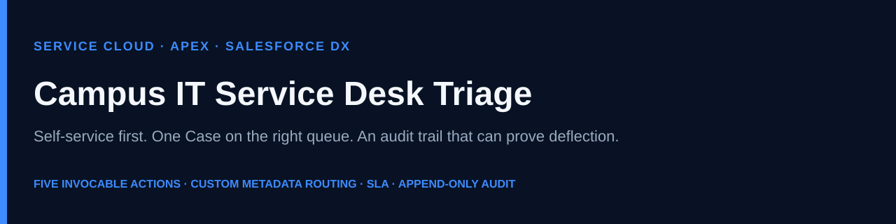

# Campus IT Service Desk Triage Agent

[](https://developer.salesforce.com/tools/salesforcecli)
[](sfdx-project.json)
[](LICENSE)



Native **Salesforce DX** backend for an **Agentforce** agent that sits in **Service Cloud**. It tries a known-issue guide first, opens one Case on the right queue when a human is required, reuses that ticket instead of creating a duplicate, and writes an append-only audit row so the desk can measure deflection.

This is not a web app and not an OAuth integration. There are no Connected Apps, named credentials, or runtime secrets. Authenticate the [Salesforce CLI](https://developer.salesforce.com/tools/salesforcecli), deploy `force-app`, assign a permission set.

**App recording (silent, captions on screen):** [docs/demo/campus-it-app-recording.mp4](docs/demo/campus-it-app-recording.mp4)

**Slide explainer (80s):** [docs/demo/campus-it-triage-agent-demo.mp4](docs/demo/campus-it-triage-agent-demo.mp4) · [Release download](https://github.com/AndrewLengLy/Campus-IT-Triage-Agent/releases/download/v1.0.0/campus-it-triage-agent-demo.mp4)

## The problem

Campus service desks drown in the same requests every shift: WiFi, password, MFA, VPN, Outlook, and “where is my ticket?” Hardware that needs a technician waits behind work a script could finish. Chatbots that only search a FAQ make that worse — they guess, they open duplicates, and nobody can prove whether they deflected anything.

## Architecture and tech stack

```
Student (Agentforce conversation)
    → Find Campus IT Self-Service Guide     IT_Known_Issue__mdt
    → Escalate Campus IT Ticket             Case + queue + SLA
    → Add Campus IT Ticket Update           Case Comment
    → Check Campus IT Ticket Status         Case Number or Student ID
    → Get Campus IT Operations Snapshot     open load + deflection
    → Campus_IT_Interaction__c              append-only audit
Technician (Lightning app Campus IT)
    → Cases, Contacts, Interactions, SLA due dates
```

| Layer | What it is |
| --- | --- |
| Conversation | Agentforce / Agent Builder (org UI — not in this repo) |
| Actions | Five `public with sharing` Apex classes, one `@InvocableMethod` each, `List` in / `List` out |
| Routing | `ITDeskRoutingService` + `IT_Category_Queue_Map__mdt` → `Campus_IT_*` queues |
| Catalog | `IT_Known_Issue__mdt` (keywords, steps, requires-escalation) |
| SLA | `IT_SLA_Rule__mdt` (High 4h, Medium 16h, Low 40h) → `Case.First_Response_Due__c` |
| Audit | `Campus_IT_Interaction__c` + `ITDeskAuditService` + before-update/delete guard |
| Workspace | Lightning app `Campus_IT`, Case layout, list views, permission set |
| Delivery | Salesforce DX source (`sf project deploy start`), API 64.0 |

Conversation copy stays in Agent Builder so service-desk leads can change tone without a deploy. Queues, articles, and SLA hours stay in Custom Metadata so they can change those without Apex. No Salesforce record IDs are hardcoded.

Deeper contracts: [`docs/architecture.md`](docs/architecture.md) · operating rules: [`docs/operating-model.md`](docs/operating-model.md)

## Key features

- **Self-service first** — matches WiFi, password, VPN, Outlook, MFA, and laptop first-aid from Custom Metadata before a Case exists.
- **Escalate once** — creates a Case with Contact link, optional email, published Case Comment, agent-sourced flag, and first-response due time.
- **Duplicate suppression** — reuses an open Case for the same student and category unless Force New Ticket is true.
- **Speech-tolerant lookups** — `s 1000-0001` stores as `S10000001`; Case Number `1234` matches `00001234`; status falls back to Student ID when the number is wrong.
- **Closed-ticket guard** — updates on closed Cases are rejected; the agent is told to open a new ticket.
- **Operations snapshot** — open agent-sourced count, high-priority count, oldest wait, queue breakdown, today’s deflection (`matches ÷ (matches + new Cases)`).
- **Append-only audit** — every action inserts `Campus_IT_Interaction__c`; a trigger blocks edit and delete.
- **Admin-owned rules** — change routing, articles, and SLA hours in Setup without a code deploy.
- **Tested in isolation** — Apex tests do not use `SeeAllData`. Test queues use `CIT_Test_*` names so they never collide with packaged `Campus_IT_*` queues.

## Setup and installation

### What you need

- [Salesforce CLI](https://developer.salesforce.com/tools/salesforcecli) (`sf version` should run)
- A **Developer Edition** org or **Trailhead Playground** (recommended). Scratch orgs in `config/project-scratch-org-def.json` can host the Apex and app; **Agentforce is not on a standard Developer scratch org**.
- Git

No `.env` values are required. See [`.env.example`](.env.example).

### 1. Clone and authorize

```bash
git clone https://github.com/AndrewLengLy/Campus-IT-Triage-Agent.git
cd Campus-IT-Triage-Agent

sf org login web --alias campus-it-dev --set-default --instance-url https://login.salesforce.com
```

Use `--instance-url https://test.salesforce.com` only for sandboxes. Trailhead Playgrounds that log in through `login.salesforce.com` use the production login host.

### 2. Deploy source

Developer Edition and Playgrounds are not source-tracked the way scratch orgs are. Use deploy, not push:

```bash
sf project deploy start --source-dir force-app --target-org campus-it-dev --wait 10
```

Equivalent manifest (same metadata): `sf project deploy start --manifest manifest/package.xml --target-org campus-it-dev --wait 10`

### 3. Verify tests

```bash
sf apex run test \
  --tests ITDeskTicketEscalationTest \
  --tests ITDeskTicketStatusTest \
  --tests ITDeskSelfServiceTest \
  --tests ITDeskTicketUpdateTest \
  --tests ITDeskDemoDataTest \
  --tests ITDeskAuditServiceTest \
  --tests ITDeskOperationsSnapshotTest \
  --target-org campus-it-dev \
  --code-coverage --result-format human --wait 10
```

### 4. Assign the permission set and seed demo data

```bash
sf org assign permset --name Campus_IT_Triage_Agent --target-org campus-it-dev
sf apex run --file scripts/apex/createDemoData.apex --target-org campus-it-dev
```

| Student ID | Name | Use for |
| --- | --- | --- |
| S10000001 | Alex Rivera | Self-service (WiFi) |
| S10000002 | Jordan Chen | Escalation after laptop first aid |
| S10000003 | Sam Patel | Status miss / no open ticket |

### 5. Technician app (works without Agentforce)

1. App Launcher → **Campus IT**
2. Open **Campus IT Agent Cases** and **Campus IT Interactions Today**
3. Optional: assign the **Campus IT Case** page layout and compact layout on Case so Student ID and first-response due show in highlights

### 6. Agentforce (conversational demo)

Required only if you want the chat preview. The org must have Agentforce enabled.

1. Create an agent (for example “Campus IT Service Desk”).
2. Add a topic such as **Student IT triage**.
3. Add these Apex actions to the topic:

   | Action label | Apex class |
   | --- | --- |
   | Find Campus IT Self-Service Guide | `ITDeskSelfService` |
   | Escalate Campus IT Ticket | `ITDeskTicketEscalation` |
   | Add Campus IT Ticket Update | `ITDeskTicketUpdate` |
   | Check Campus IT Ticket Status | `ITDeskTicketStatus` |
   | Get Campus IT Operations Snapshot | `ITDeskOperationsSnapshot` |

4. Paste the instructions from [`docs/agent-builder-topic.md`](docs/agent-builder-topic.md).
5. Assign **Campus IT Triage Agent** to the Agentforce running user.

Keep Agent Builder instruction text in sync with the Apex `@InvocableVariable` labels if you edit either side.

### Install from an unmanaged package (optional)

Prefer CLI deploy. If you need a click-to-install URL, build the package from a Developer Edition org you will keep, using the checklist in [`docs/packaging.md`](docs/packaging.md). After upload, replace this line with the real `04t` install URL — do not invent one:

```
https://login.salesforce.com/packaging/installPackage.apexp?p0=04tXXXXXXXXXXXX
```

Post-install: assign the permission set, seed demo data, assign the Case layout, then (if available) wire Agent Builder.

## Usage walkthrough

Eight-minute version: [`docs/demo-script.md`](docs/demo-script.md). Sixty-second recording script: [`docs/video-script.md`](docs/video-script.md).

**Without Agentforce** — open **Campus IT**, inspect Jordan’s seeded High hardware Case (first-response due, self-service article, published comment) and today’s interaction rows.

**With Agentforce** — in the agent preview:

1. *“Campus WiFi keeps dropping in my residence hall. My student ID is S10000001.”* — guide, no new ticket if the steps are enough.
2. *“My laptop will not power on and I have an exam. Student ID S10000002. I already tried a different charger.”* — first aid, then one Hardware Case. Read back the Case Number.
3. Same student, same laptop — the open ticket is reused; a comment is added.
4. *“How busy is the Campus IT desk?”* — operations snapshot (open count, oldest wait, deflection).

Routing, articles, and SLA hours: **Setup → Custom Metadata Types** (`IT_Category_Queue_Map`, `IT_Known_Issue`, `IT_SLA_Rule`).

| Keyword | Aliases | Queue |
| --- | --- | --- |
| network | wifi, vpn | `Campus_IT_Network` |
| hardware | laptop, printer | `Campus_IT_Hardware` |
| software | application, license, email, outlook | `Campus_IT_Software` |
| account | password, login, identity, mfa | `Campus_IT_Identity` |
| (default) | | `Campus_IT_General` |

## Repository map

```
force-app/main/default/   Apex, objects, CMT, queues, app, permset
manifest/package.xml      Same metadata, manifest deploy / packaging checklist
scripts/apex/             Demo Contact + walkthrough seed
docs/                     Architecture, operating model, Agent Builder copy, packaging
```

## Security

- No API keys, OAuth clients, or `.env` secrets
- `public with sharing` on student-facing classes
- Audit writes are system-mode so a missing field permission cannot drop the trail; the trigger still blocks tampering
- Permission set grants Case create/edit, Interaction create/read (no edit/delete), Contact read

## License

[MIT](LICENSE)
